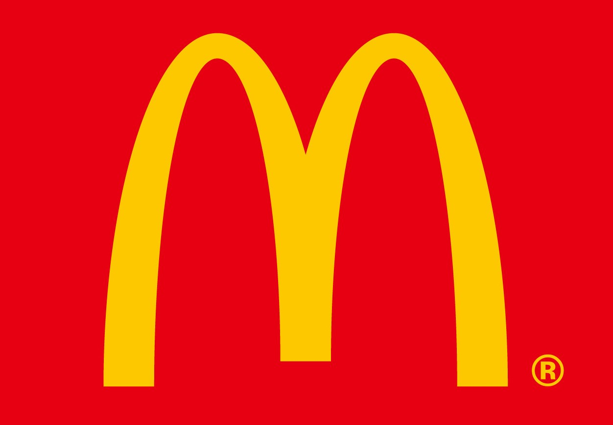

# 社团宣传中的平面设计
_著作权归作者所有_

 **
谨以此文献给GYMUN
** 

## 引言
&nbsp;&nbsp;&nbsp;&nbsp;
两年前笔着正在一所高中里担任某社团的副社长，新上任不久便要组织社团的技术组为社团成员们设计名片。尽管我多次向他们强调在宣传设计中的几点简单要求，他们的稿件仍然不甚令人满意。于是我只能亲自上马。

&nbsp;&nbsp;&nbsp;&nbsp;

&nbsp;&nbsp;&nbsp;&nbsp;本文暂且不对上面的设计做出评论，只是从这一个较好的例子中，引出三个我们在社团宣传的平面设计作品中，非常值得采用的理念：
1.  **扁平化设计**
2.  **标志配色**
3.  **图片代替文字**

这三个理念为我们的设计提供了很好的大体思路，合理地运用它们，是宣传工作中不断加深人们对社团印象的关键。因为本文篇幅有限，略去具体的实践方法，也许下次可以再讨论。

## 扁平化设计
&nbsp;&nbsp;&nbsp;&nbsp;
智能设备界面的设计从拟物化变为扁平化已经是现在的发展趋势，我们可以用一个很好的例子来展示这两者的区别。

这是Instagram的logo，帮助我们直观的感受到扁平化对图形简化的特征。

>扁平化概念的核心意义是：去除冗余、厚重和繁杂的装饰效果。而具体表现在去掉了多余的透视、纹理、渐变以及能做出3D效果的元素，这样可以让“信息”本身重新作为核心被凸显出来。同时在设计元素上，则强调了抽象、极简和符号化。

&nbsp;&nbsp;&nbsp;&nbsp;
扁平化设计化繁为简的作法充分诠释了少即是多的理念。在名片中，正面右侧以及背面的社徽正是采用了扁平化，**这样的简易图形强调了少数的几个重要元素，加大了对观看者的视觉冲击，从而让人更容易对这个社团产生深刻的印象。**

以下是未经扁平化处理的社徽，显然不及处理后的令人印象深刻。

## 标志配色
&nbsp;&nbsp;&nbsp;&nbsp;
当我们说起红黄两种颜色，相信大多数人最先想起的应该是麦当劳。麦当劳长期以来的广告宣传不断重复着这个饱和度极高的配色，也打造这种配色和这个品牌之间的不可磨灭的联系。

这样的例子还有很多，像苹果的黑与白，百事可乐的红与蓝……没错，这正是传媒设计中著名的**视觉锤**理论。它侵占了我们的一种感官，将品牌形象深深打入人心。

&nbsp;&nbsp;&nbsp;&nbsp;
回到名片，你肯定已经发现，我们社团所贯彻使用的配色是主蓝色副绿色。**为社团宣传选择一个高饱和的配色方案，并一直坚持重复，会让社团别具一格、与众不同，在五颜六色、眼花缭乱的宣传栏中凸显身份。**

&nbsp;&nbsp;&nbsp;&nbsp;
宣传设计中大面积的标志配色在我的任职期间始终如一。

&nbsp;&nbsp;&nbsp;&nbsp;

## 图片代替文字
&nbsp;&nbsp;&nbsp;&nbsp;
俗话说“一图抵千言”，平面设计的本质就是用图像传达信息。
>平面设计，也称为视觉传达设计，是以“视觉”作为沟通和表现的方式，透过多种方式来创造和结合符号、图片和文字，借此作出用来传达想法或讯息的视觉表现。

&nbsp;&nbsp;&nbsp;&nbsp;
平面设计中的字体设计将字符元素化，其本质就是将刻板的文字转化为生动的图形，从而更高效简易的达到传达想法和讯息的目的。简单来讲，上述的名片中联系方式前用logo进行标志，接到名片的人就可以迅速理解后面一串数字字母的含义。一方面logo比“电话”、“微信”之类的文字更直观，另一方面，也比后者更加贴近扁平化设计，更加合适参与到整体的空间构成。一下再举两个简单的例子:

&nbsp;&nbsp;&nbsp;&nbsp;

&nbsp;&nbsp;&nbsp;&nbsp;
椅子和相机清楚的传达了自己的身份，减少了人们互相长时间盯着对方胸口看的尴尬。**在社团宣传中，用图像代替文字，可以更加简明迅速地传达我们的想法和讯息，节省观看者的时间，不仅为宣传作品提高设计感，也赢得了观看者的好感，加深了自身印象。**

