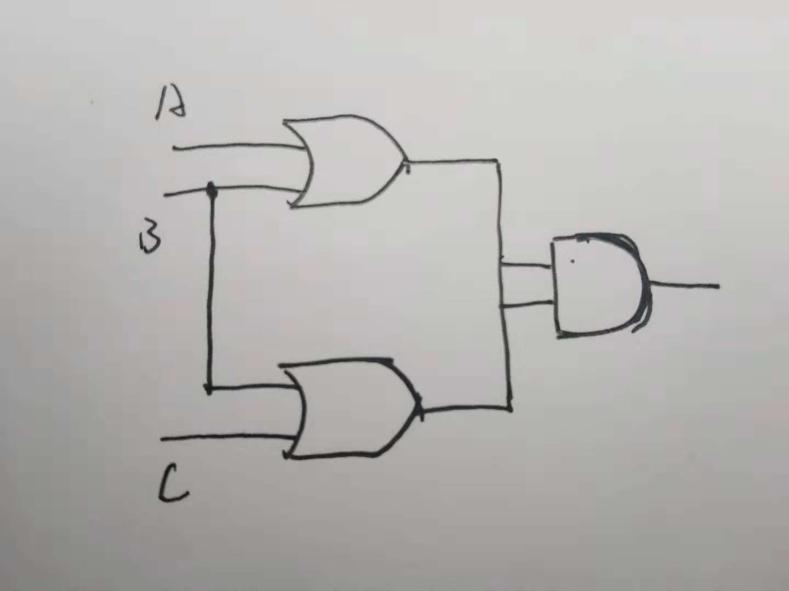
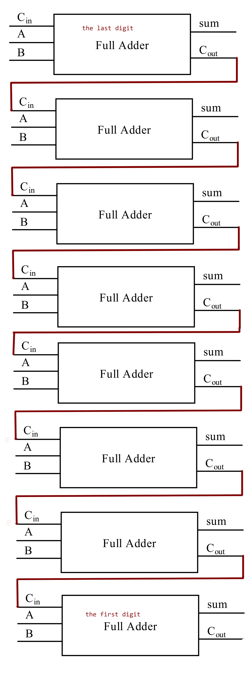

#Chapter 05

## 1) AND gate

| Boolean expressions | Logic diagram  |
|:-------------|:------------------|
| X = A · B     |  | 

**Truth table**
| A | B | X |
|:--|:--|:--|
| 0 | 0 | 0 |
| 0 | 1 | 0 |
| 1 | 0 | 0 |
| 1 | 1 | 1 |

If the two input values for an AND gate are both 1, the output is 1; otherwise, the output is 0.

## 1) XOR gate

| Boolean expressions | Logic diagram  |
|:-------------|:------------------|
| X = A ⊕ B     |  | 

**Truth table**
| A | B | X |
|:--|:--|:--|
| 0 | 0 | 0 |
| 0 | 1 | 1 |
| 1 | 0 | 1 |
| 1 | 1 | 0 |

The XOR gate produces a 1 only if its inputs are mixed(one 1 and one 0).

## 3) (A+B)(B+C)

## 4)
**Truth table**
| A | B | X |
|:--|:--|:--|
| 0 | 0 | 1 |
| 0 | 1 | 1 |
| 1 | 0 | 0 |
| 1 | 1 | 1 |

## 5) Circuit equivalence
The same output for each corresponding input-value combination for two circuits.

| A | B | AB |(AB)'|
|:--|:--|:---|:----|
| 0 | 0 | 0  |1 |
| 0 | 1 | 0  |1 |
| 1 | 0 | 0  |1 |
| 1 | 1 | 1  |0 |

| A | B | A'| B'|A'+B'|
|:--|:--|:--|:--|:--|
| 0 | 0 | 1 |1|1|
| 0 | 1 | 1 |0|1|
| 1 | 0 | 0 |1|1|
| 1 | 1 | 0 |0|0|

## 6)

## 7)

(1)X8 X7 X6 X5 1 1 1 1 
 
(2)X8 X7 X6 X5 X4' X3' X2' X1'
 
(3)X8 X7 X6 X5 X4' X3' X2' X1'
 

## Definition

### 1)Logic gate

In electronics, a logic gate is an idealized or physical device implementing a Boolean function; that is, it performs a logical operation on one or more binary inputs and produces a single binary output.在电子学中，逻辑门是实现布尔函数的理想化或物理设备; 也就是说，它对一个或多个二进制输入执行逻辑运算并产生单个二进制输出。

## 2)Boolean algebra

In mathematics and mathematical logic, Boolean algebra is the branch of algebra in which the values of the variables are the truth values true and false, usually denoted 1 and 0 respectively.在数学和数学逻辑中，布尔代数是代数的分支，其中变量的值是真值和真值，通常分别表示为1和0。

1)触发器

2)One bit.