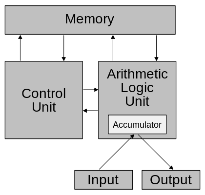

# Chapter06

1.

2.26bits

3.(1)运算器：算术、逻辑（部件：算术逻辑单元、累加器、寄存器组、路径转换器、数据总线）

(2)控制器：复位、使能（部件：计数器、指令寄存器、指令解码器、状态寄存器、时钟发生器、微操作信号发生器）

4.It is a non-volatile memory (does not lose stored data when the device is powered down) that is not directly accessible by the CPU, because it is not accessed via the input/output channels (it is an external device). In RAM devices (as flash memory) data can be directly deleted or changed.

SSD

7.1)3:第三代 1333:数据传输速率为1333mt/s
2)能

