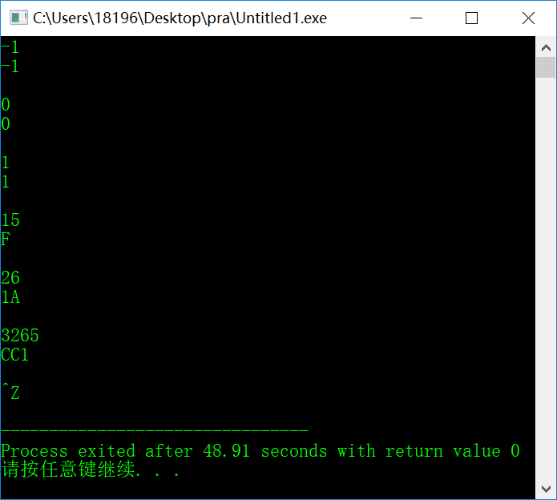

# Chapter 08

## 1、阅读 Pseudocode Standard。（答案可以打印）
### 1）用伪代码描述将十进制转换成16进制的方法

```basic
INITIALIZE Hexadicimal by 0
INPUT OriginalDecimal

IF OriginalDecimal < 0 THEN
    ASSIGN Decimal by the opposite number of OriginalDecimal
ELSE IF OriginalDecimal EQUAL 0 THEN
    PRINT 0
    END program
ELSE
    ASSIGN Decimal by OriginalDecimal
END IF

WHILE Decimal NOT EQUAL 0
    MULTIPLY Hexadecimal by 16
    ADD Decimal MOD 16 to Hexadecimal
    DIVIDE Decimal by 16
END WHILE

IF OriginalDecimal < 0 THEN
    ASSIGN Hexadecimal by the opposite number of Hexadecimal
END IF

PRINT Hexadecimal
```

### 2）C语言实现（先用注释写好算法，然后翻译）
```c
#include <stdio.h>
#include <string.h>

const int MAXN = 10005;
int main(){
    // INITIALIZE Hexadicimal by 0
    // INPUT OriginalDecimal
    int OriginalDecimal, Decimal, tmp, ptr = -1;
    char Hexadecimal[MAXN];
    scanf("%d", &OriginalDecimal);
	
    // IF OriginalDecimal < 0 THEN
    if(OriginalDecimal < 0)
        // ASSIGN Decimal by the opposite number of OriginalDecimal
        Decimal = -OriginalDecimal;
	
    // ELSE IF OriginalDecimal EQUAL 0 THEN
    else if(OriginalDecimal == 0){
        // PRINT 0
        // END program
        printf("0");
        return 0;
    
    // ELSE
    }else
        // ASSIGN Decimal by OriginalDecimal
        Decimal = OriginalDecimal;
    
    // END IF

    // WHILE Decimal NOT EQUAL 0
    while(Decimal){
        // MULTIPLY Hexadecimal by 16
        ptr++;

        // ADD Decimal MOD 16 to Hexadecimal
        tmp = Decimal % 16;
        if(tmp <= 9)
            Hexadecimal[ptr] = tmp + '0';
        else
            Hexadecimal[ptr] = tmp - 10 + 'A';

        // DIVIDE Decimal by 16
        Decimal /= 16;
    }
    // END WHILE
    Hexadecimal[++ptr] = '\0';
    strrev(Hexadecimal);
    
    // IF OriginalDecimal < 0 THEN
    //     ASSIGN Hexadecimal by the opposite number of Hexadecimal
    // END IF
    if(OriginalDecimal < 0)
    	printf("-");
    
    // PRINT Hexadecimal
    printf("%s", Hexadecimal);
}
```

### 3）使用 -1, 0, 1, 15, 26，3265 作为输入测试你的程序


## 2、名词解释与对比
### 1）Top-down design
A top-down approach (also known as stepwise design) is essentially the breaking down of a system to gain insight into the sub-systems that make it up. In a top-down approach an overview of the system is formulated, specifying but not detailing any first-level subsystems. Each subsystem is then refined in yet greater detail, sometimes in many additional subsystem levels, until the entire specification is reduced to base elements. Once these base elements are recognised then we can build these as computer modules. Once they are built we can put them together, making the entire system from these individual components.

### 2） Work breakdown structure (WBS)

A work-breakdown structure (WBS)[2] in project management and systems engineering, is a deliverable-oriented breakdown of a project into smaller components. A work breakdown structure is a key project deliverable that organizes the team's work into manageable sections. The Project Management Body of Knowledge (PMBOK 5) defines the work-breakdown structure "A hierarchical decomposition of the total scope of work to be carried out by the project team to accomplish the project objectives and create the required deliverables."

### 3）简述管理学 WBS 与 信息学Top-down设计 的异同

## 3、仔细观察您洗衣机的运作过程，运用Top-down设计方法和Pseudocode 描述洗衣机控制程序。假设洗衣机可执行的基本操作如下：

注水
```basic
IF  water_in_switch  is  on
    pour  in  water 
    IF  water_volume  is equal to standard_volume
        turn  off  water_in_switch
        stop  pouring  water
    END IF
END IF
```
浸泡
```basic
IF  water_in_switch  is  off
    Get time
    IF time is equal to standard time
        stop soaking
    END IF 
END IF
```
电机转动
```basic
IF  soaking time is reached 
    start motor running
    WHILE  time is not reached
        Run to left 
        Run to right
        Stop
    END WHILE 
END IF
```
排水
```basic
IF  motor_run is over
    let out water
    IF  water_volume is equal to 0
        Stop letting out water
    END  IF
END  IF
```
停机
```basic
IF  water_volume is equal to 0
    Halt
    Turn off the light
END  IF

```

