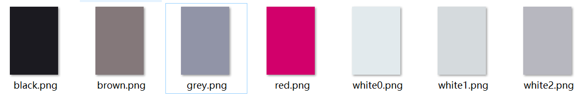

# 使用Construct2制作2048

_by Syderny_

**此博客为主要操作指引，供制作者对照快速上手；同时附有部分笔者在游戏制作中遇到的问题与感悟的快捷方法记录，供同好参考交流，避免如笔者一般绕远路；若需查看详细指引及步骤解释请点击`新手入门游戏指引（官网）`超链接。**

## 一、工具Constuct2

* Construct 2：[官网地址](https://www.scirra.com/construct2)

* [官网下载地址](https://www.scirra.com/manual/2/installing)

* [新手入门游戏指引（官网）](https://www.scirra.com/tutorials/37/beginners-guide-to-construct-2)

## 二、步骤
1.新建项目

打开construct2，点击左上角的File，选择New。（或者直接按`ctrl+n`）

选择第一项

2.设置背景

用ps做出自己的背景图片。什么？你不懂ps？回去自学啊。

双击面板，弹出Insert New Object窗口，选择Tiled Background

出现Edit Texture窗口，点击File按钮

在文件夹中选择你自己做好的背景图片。在左侧Properties面板中修改背景的位置和大小。

背景就大功告成了。

3.添加精灵

当然精灵不是真的精灵，只是游戏程序中的对象。什么？你说你不知道什么是对象？好好回去上程序设计的课吧。
制作自己的精灵。

再次进入Insert New Object，点击Sprite。

文件中加入精灵。

4.设置精灵的参数和事件
左边Properties里修改，我真的不想重复了。

点击Behaviors，添加动作并设置条件。

5.设置HUD
相信有前面教程，你可以自己摸索。

什么？你不会？可能是你太弱了。

**然后就大功告成了。**

记住我，我是Syderny。
顺带一句，让不感兴趣的计算机学生花时间弄懂这个真的很没意义。