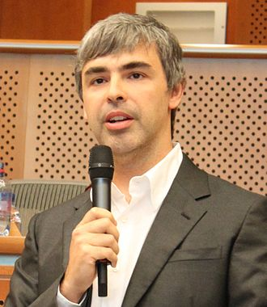
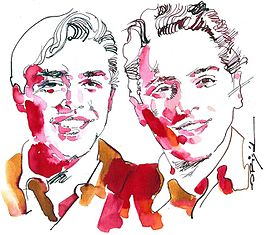
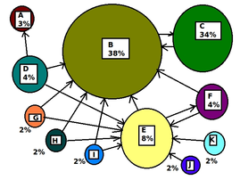

# 拉里·佩奇 Lawrence Award Page

| 姓名        | Larry Page          |
|:-------------|:------------------|
| 国籍           | 美国 |
| 生日 | 1973.3.26   |
| 职位           |  谷歌CEO     |
| 成就           | 谷歌创始人之一 |

## Brin
&emsp;1992年佩奇进入密西根大学学习，在美国安阿伯就读期间，他担任密西根大学Eta Kappa Nu荣誉学会的会长，并是太阳能汽车组织的成员之一，他还用乐高积木制成一台可编程的绘图喷墨打印机，其指导教授是 Terry Winograd 博士。

&emsp;1996年，佩奇进入斯坦福大学学习，在攻读计算机理学博士学位期间，拉里·佩奇遇到了谢尔盖·布林，佩奇在斯坦福大学获得博士学位后，开始休学。

## PageRank
&emsp;1996年，佩奇和布林开始合作研究一名为“BackRub”的搜索引擎，到1998年上半年逐步完善这项技术后，两人合作运行Google搜索，并以PageRank为基础给网页排名，同时两人也开始为这项技术寻找合作伙伴。

  佩奇和布林 

&emsp;他们找到雅虎的创始人之一戴维·菲洛，菲洛认为他们的技术确实很可靠，但建议他们自己建立一个搜索引擎公司发展业务，发展起来后再考虑合作。他们的一位教师，也是SUN微系统的创始人之一安迪·别赫托希姆在关键时刻给予他们很大帮助。别赫托希姆确是个很有远见的人，在看完他们的演示后，立马开了张10万美元的支票帮助成立Google公司。之后两人又从家人朋友那里到处借钱，筹得100万美元作为最初投资。

>&emsp;PageRank，网页排名，又称网页级别、Google左侧排名或佩奇排名，是一种由根据网页之间相互的超链接计算的技术，而作为网页排名的要素之一，以Google公司创办人拉里·佩奇（Larry Page）之姓来命名。Google用它来体现网页的相关性和重要性，在搜索引擎优化操作中是经常被用来评估网页优化的成效因素之一。Google的创始人拉里·佩奇和谢尔盖·布林于1998年在斯坦福大学发明了这项技术。

>&emsp;PageRank通过网络浩瀚的超链接关系来确定一个页面的等级。Google把从A页面到B页面的链接解释为A页面给B页面投票，Google根据投票来源（甚至来源的来源，即链接到A页面的页面）和投票目标的等级来决定新的等级。简单的说，一个高等级的页面可以使其他低等级页面的等级提升。

 PageRank原理

## Google

&emsp;1998年9月7日，Google公司在加利福尼亚州的曼罗帕克正式成立。他们雇用了第一位员工克雷格·希尔弗斯坦成为Google公司的科技主管。

&emsp;1999年2月他们搬了新的办公室，虽然条件仍然简陋，但比车库好点，一张乒乓桌就作为正式的会议场所，8名员工在办公室里都转不过身，一个人要出门所有人都得起身挪开凳子才能腾出地方。到了6月份时，Google得到红杉资本和Kleiner Perkins Caufield两家风险投资基金的2500万美元注资，并在9月21日这天，Google不再是测试版的搜索引擎，开始每天处理约3亿个搜索结果。

&emsp;2000年在佩奇的领导下Google发展成为最大的互联网搜索引擎，雅虎选择Google作为默认的搜索结果供应商。

&emsp;2001年，佩奇辞去了CEO的职位，从 Novell公司聘请埃里克·施密特博士担任谷歌公司CEO，自己则担任了产品总监。

## Page

&emsp;佩奇认为，创新才是谷歌的未来，而不仅仅是保持现有的实用性。佩奇说：“很多公司一旦开始盈利，就会减少对研发的投入。的确，做你熟悉的事情确实非常容易。但是，过去的经验告诉我们，一旦停止创新，就很有可能被他人所超越。”因此，对于管理像谷歌这样的新型互联网公司，需要的不仅仅是发扬已有产品，更重要的在于对公司产品研发的不断投入和鼓励，去让公司开拓更多新的方向。并且，佩奇认为创新没有实现商业化是没有意义的，它举了一个例子，施乐公司帕洛阿尔托研究中心是一家著名的专注于大思路和创新的公司，它贡献了许多创新，但是却因为糟糕的商业化导致最终的失败。

&emsp;在面对竞争方面，佩奇认为公司的动机很重要，与其将注意力放在竞争对手上，去做相同的产品以谋求与他的竞争，去保护自己，不如去研究新的和有趣的东西更使自己有生命力。