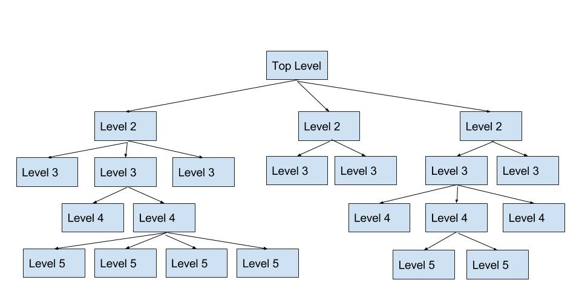

# 自顶向下设计
采用传统过程式语言进行模块化编程时，主要通过自顶向下方法来进行系统设计。自顶向下设计也称为逐步求精（stepwise refinement），是将一个系统逐层分解为子系统的设计过程。首先，对整个系统进行概要设计，指明构成系统的顶层子系统有哪些，注意在此并不给出各个子系统的细节。其次，对每个子系统重复这个设计过程，即再将每个子系统分解为下一层的子系统。就这样不断细化每个子系统，直至子系统的功能足够简明，可以直接编码实现为止。

自顶向下设计具有两个特征：第一，要求设计者一开始就对整个系统有清楚的理解，否则第一步的分解就无法进行；第二，任何子系统在足够细化之前无法开始编码实现，因而必须等到所有子系统都足够细化，才可能对系统编码实现及测试。

更具体地说，用自顶向下方法编程序时，总是先写主程序，它是由根据系统功能划分而成的功能子程序组成的。然后再分析每个子程序的需求，如果有必要就继续像主程序一样分解下去。当划分出来的子程序最终具有非常简单的功能时，就直接编码实现。当所有子程序都编码实现，整个程序也就实现了。可以相信，由于分解过程总是导致越来越小的程序部件， 最终必然达到“足够简单”的层次，因此不可能无限分解下去。



下面通过一个案例程序来演示自顶向下设计方法。 

```
程序：washing machine
    注水
    漂洗
    排水
    脱水
```
## 顶层设计

```
def main()
    def water_in_switch, water_volume, motor_run, time
    注水()
    漂洗()
    排水()
    脱水()
```
至此，我们做出了washing machine程序的顶层设计，将原始问题分解成了四个模块，当然各模块的细节尚不清楚。主程序虽然只有寥寥几行，看上去不过是上面的算法伪代码略加细化的结果，但它确实满足程序规格说明的要求。此外，我们还为对应每个模块的函数声明了函数名、参数和返回值，这些信息构成了函数的接口（interface）。在 main 这个层次，并不需要关心函数的实现细节，只需要关注它们对于给定的参数能返回预定的数据。 亦即，只关心每个子程序“做什么”，而非“怎么做”。函数接口正是表达“做什么”信息的。

自顶向下设计中经常使用一种设计工具——结构图（或称模块层次图），其中用矩形表 示程序模块，用两个矩形之间的连线表示模块间的调用关系，在连线旁边用箭头和标注来指明模块之间的界面信息。各模块分别处于不同层次，高层模块是调用模块（或控制模块），低层模块是被调用模块（或受控模块）。结构图最顶层就主程序（总控模块）。

## 下层设计

注水
```basic
IF  water_in_switch  is  on
    pour  in  water 
    IF  water_volume  is equal to standard_volume
        turn  off  water_in_switch
        stop  pouring  water
    END IF
END IF
```
浸泡
```basic
IF  water_in_switch  is  off
    Get time
    IF time is equal to standard time
        stop soaking
    END IF 
END IF
```
电机转动
```basic
IF  soaking time is reached 
    start motor running
    WHILE  time is not reached
        Run to left 
        Run to right
        Stop
    END WHILE 
END IF
```
排水
```basic
IF  motor_run is over
    let out water
    IF  water_volume is equal to 0
        Stop letting out water
    END  IF
END  IF
```
停机
```basic
IF  water_volume is equal to 0
    Halt
    Turn off the light
END  IF

```

## 总结
Washing machine程序的完整开发过程，展示了自顶向下设计方法的强大能力。当面临一个复杂问题而感到无从下手的时候，可以尝试将原始问题分解为若干个子问题，然后再去考虑每个子问题的解决方案。这个分解过程可以重复进行，从结构图的顶层开始，自顶向下逐步求精，直至得到所有子问题的精确代码。

自顶向下设计过程可以概括为以下四个步骤：
（1）将问题分解为若干子问题；
（2）为每个子问题设计一个函数接口；
（3）将原问题的算法用各子问题对应的函数接口来表达；
（4）对每个子问题重复（1）～（3）的过程。经过以上步骤，高层的抽象接口在低层逐步得到细化，最终到达可以直接用 Python 基本语句实现的层次。

自顶向下设计是编写复杂程序的重要工具，虽然这种方法会导致很多小模块（函数），看上去设计起来有点麻烦，但这其实是事半而功倍的方法。事实上不采用模块化方法是不可能设计出复杂系统的。

模块化设计和单元测试都是分离关注点原则的具体体现，前者使我们能够设计复杂程序，后者使我们能够调试复杂程序。作为初学者，应当不断地实践模块化方法，让模块化思想和方法变成自己的本能思维方式。

最后要说明一点，自顶向下设计是非常强大的编程技术，但并非唯一的编程技术，有时这种设计方法并不可行。例如，自顶向下设计的第一步是对整个系统进行任务分解，然而在开发某些应用时，可能无法对整个系统的需求先有充分的理解，只能随着开发的进行，逐渐获得对系统的理解，这时就不可能采用自顶向下设计。

本书后面还会介绍其他程序设计方法，比如原型方法、面向对象设计等等。程序设计是一个创造性的过程，并不存在什么唯一正确的方法或者一成不变的规则。好的开发者应当掌握多种设计方法。虽然通过读书学习可以了解程序设计技术，但更重要的是通过实践来掌握 在什么场合应用以及如何应用这些方法。
