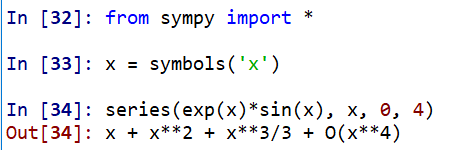
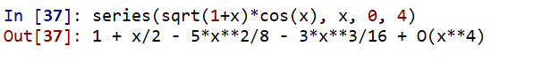
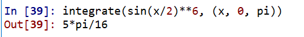
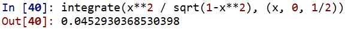
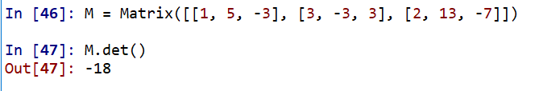
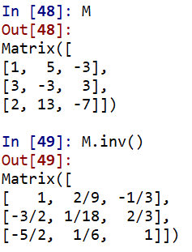

# 用 python 做计算器，做数学题

## 高数
### 1. 求下列函数在 x = 0 点的局部泰勒公式至x4

(1)
$$ e^xsinx $$

(2)
$$ \sqrt{1+x}cosx $$

### 2. 求下列各定积分
(1)
$$ \int_0^\pi sin^6{x\over2}dx $$

(2)
$$ \int_0^{1\over2} {x^2 \over \sqrt{1-x^2}}dx $$

## 线代
### 1. 求下列矩阵的行列式
$$
 \begin{bmatrix}
   1 & 5 & -3 \\
   3 & -3 & 3 \\
   2 & 13 & -7
  \end{bmatrix}
$$

### 1. 求上一题矩阵的逆矩阵

