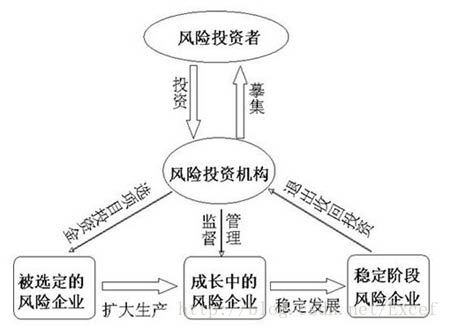
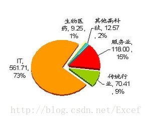

# 吹水

## 简介
### 风险投资
（英语：Venture Capital，缩写为VC）简称风投，又译称为创业投资，是一种私募股权，一种融资形式，由公司或基金提供给被认为具有高增长潜力或已经表现出高增长的小型早期新兴公司（员工数量，年收入或两者兼而有之）。典型的风险资本投资发生在最初的“种子资金”轮次之后。第一轮为增长提供资金的机构风险资本被称为A轮融资。风险资本家提供此融资是为了通过最终的“退出”事件产生回报，例如公司首次在首次公开募股（IPO）中向公众出售股票或进行并购（也称为作为公司的“贸易销售”）。风险投资公司或基金投资于这些早期阶段的公司，以换取他们投资的公司的股权或所有权股份。风险投资家承担风险，为有风险的初创公司提供融资，希望他们有些公司能够支持将成功。

### IT

IT,即信息技术（Information Technology）,是主要用于管理和处理信息所采用的各种技术总称。它主要是应用计算机科学和通信技术来设计、开发、安装和实施信息系统及应用软件。它也常被称为信息和通信技术（Information and Communications Technology, ICT）,信息技术的研究包括科学，技术，工程以及管理等学科。这些学科在信息的管理，传递和处理中的应用，相关的软件和设备及其相互作用。

## 浅谈

近几十年来，风投对中国IT界的发展起到了很大的作用。因为风险投资不需要抵押，也不需要偿还。如果投资成功，投资人将获得几倍、几十倍甚至上百倍的回报;如果失败，投资者也只能自己承担损失。对当时的IT创业者来讲，在中国发展IT行业的潜力是巨大的，但风险也是极高的，因为创新需要有很高的要求。所以，对于创业者，使用这种投资方式创业的最大好处在于即使失败，也不会背上债务，这样就使得年轻IT人创业成为可能。海归企业亚信科技创始人田溯宁、百度董事长兼首席执行官李彦宏、中星微电子有限公司董事长邓中翰、空中网总裁杨宁、北极光的邓锋、网讯公司(WebEx)创始人朱敏、携程网及如家快捷酒店创始人沈南鹏、携程网董事会主席梁建章、展迅通信科技有限公司总裁武平等人都是因为这种方式才能走到今天的地步。