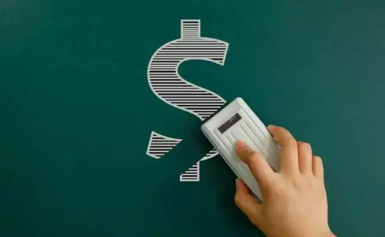

# 互联网盈利模式

盈利模式分为自发的盈利模式和自觉的盈利模式两种，早期的中国互联网并没有清晰的盈利模式，大家都在摸索尝试，很多靠卖广告勉强维持生计。现如今，互联网的盈利模式越来越有规律可循，很多公司一开始就设计好产品清晰的盈利模式进入了自觉盈利，他们越来越有钱，财富积累的速度也越来越快。滴滴从0~1，仅用了6年，估值达到800亿美元。滴滴不拥有一辆汽车，但是它的规模比任何一家出租车公司都要大很多。在互联网时代“连接比拥有更重要”，滴滴连接了2000多万个司机，微信月活用户达10个亿，微博的月活用户达4亿人，美团点评月活用户8000多万。在互联网时代，流量就是金钱，有了流量，有了用户，就不愁赚不到钱。10亿用户一人一个月给腾讯创造一元收益，腾讯一个月就能赚10亿人民币（地主小时候做过这样的梦，如果全中国人一人给我1块钱，我就可以轻松走上人生巅峰了，笑醒）。然而，并不是每个公司都那么幸运，能够找到自己的盈利模式，很多创业公司烧光了投资人的钱，还是没能盈利，最后死掉。那么互联网产品的盈利模式有哪些？最好的流量变现方式是什么？今天地主就带大家总结下当前中国互联网的六大主流盈利模式。

## 一、卖广告
卖广告是早期中国互联网最原始的盈利模式，一直延续到了现在。在门户时代，四大门户网站就开始卖各种广告位，焦点图、通栏、弹窗等，经过20年的进化，广告形式越来越多样化，大数据让目标用户的定向也越来越精准，广告业务也从SSP走向了DSP
广告类型：网盟广告（eg：百度网盟、阿里妈妈、其他中小网盟）、移动广告（eg：多盟、有米、艾德思奇、点入）、搜索竞价广告（eg：百度SEM）、信息流广告（eg：腾讯社交广告、今日头条、新浪粉丝通、新浪扶翼、网易有道）
企业代表：百度（百度：我们是一家科技公司，我们不是广告公司；我：请看财报）
## 二、电商卖货（包括实物产品和虚拟商品）
世界上最早的电子商务公司是如今的世界首富Jeff Bezos 在1995年创办的亚马逊。中国最早的电子商务公司则是马爸爸在1999年创办的8848
电商类型：B2B、B2C、C2C、F2C、O2O
产品代表：慧聪网（B2B）、网易严选（B2C）、淘宝(C2C)、直卖网（F2C）、O2O（美团网）
注：严格来说淘宝天猫的盈利模式不是卖货，他们只是给商家提供了一个卖货的平台，他们真正盈利的是商家交易抽成和直通车、钻展等广告业务。
## 三、平台佣金抽成
平台促成交易后，向商家收取佣金，平台不直接生产创造价值，而是去整合资源。这种方式就像房地产中介里的链家，一头对接房东，另一头对接买房者，当交易达成时抽取2%的费用作为佣金。5月11日刚在美国纽交所敲钟上市的虎牙直播为代表的直播平台最主要的盈利模式便是抽取平台上主播的粉丝打赏或者礼物。
抽成对象：商家、司机、威客、主播
产品代表：天猫（商家）、美团（商家）、滴滴（司机）、八戒网（威客）、虎牙直播（主播）
四、增值服务
基础功能免费，高级功能收费。先用免费的产品和服务去吸引用户，去抢占市场份额和用户规模，然后再通过增值服务或其他产品收费。今年4月底，雷军在小米的发布会上说小米硬件的净利润率不超过5%，他可能没有撒谎，因为在小米的生态链条里，硬件免费+内容/服务收费，这是一个完整的生态闭环模型
服务类型：更高级的功能/内容/服务、会员特权、虚拟道具
产品代表：360杀毒（企业服务）、QQ会员（会员特权）、王者荣耀（虚拟道具）、WPS办公软件 （会员特权）、百度网盘（会员特权）
五、收费服务
收费服务早已有之，例如家政服务、家教、导游、律师咨询等，但在互联网时代服务的类型变得更加多元化。想起来前段时间刷屏的陶渊明后人，一个90后在喜马拉雅做主播靠讲故事月入百万，实现财富自由，这在10年前根本是不可能发生的事，但现在发达的SNS网络以及方便的在线支付技术，让这样的事情每天都在发生。
服务类型：产品、信息、功能、技术、API接口、知识、内容、经验、咨询
产品代表：阿里云服务器（功能）、友盟（技术/数据）、高德地图（接口）、网易云课堂（知识）、樊登读书会（内容）、分答（经验）、在行（咨询）
六、金融运作
肉从冰箱里拿出来，再放回去。问：手里剩下啥？当然是油水啊！
这就是腾讯和阿里为什么一直拼了命要抢夺用户的支付入口。在今年3月份沃尔玛站队腾讯，开始停用支付宝仅支持微信支付。
运作方式：金融借贷、账期、沉淀资金、资金池、旁氏大法
产品代表：花呗（借贷）、简书等平台打赏提现规则（满100元才能提现；我里面的15元，我不要了，送给你好吧~）、摩拜（沉淀资金）、拍拍贷（资金池）、善林金融（旁氏大法，已被制裁）